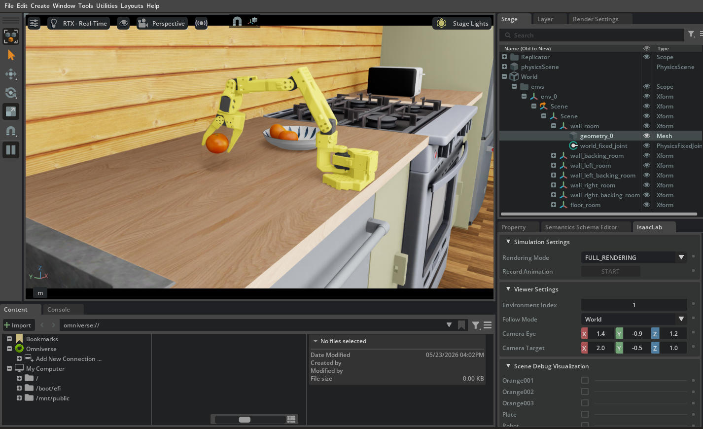

# LeIsaac — vitorcen fork

> 📦 本仓库是母项目 **[vitorcen/isaaclab-experience](https://github.com/vitorcen/isaaclab-experience)** 的一个子模块（manipulation / VLA 微调线）。
> _Part of the parent project **[vitorcen/isaaclab-experience](https://github.com/vitorcen/isaaclab-experience)** — the manipulation / VLA fine-tuning track._

[LightwheelAI/leisaac](https://github.com/LightwheelAI/leisaac) (Apache-2.0) 的 fork。在 upstream 提供的 SO-101 遥操 + GR00T N1.5/N1.6 微调配方之上，扩展了**通用 LeRobot 微调脚手架**、**PickOrange 多策略横评**、以及一组让非平凡 VLA 能在 Isaac Sim 上跑通的 client 端补丁。
_A fork of [LightwheelAI/leisaac](https://github.com/LightwheelAI/leisaac) (Apache-2.0). Extends the upstream SO-101 teleop + GR00T fine-tune recipes with a generic LeRobot fine-tune scaffold, a PickOrange multi-policy benchmark, and client-side fixes that make non-trivial VLAs evaluable in Isaac Sim._


_自训 GR00T-N1.7 ckpt-6000：3/3 oranges placed @ 87s, BENCH 5-round = 14/15 (4/5 envs) — 平 hi-space N1.7 SOTA。HF: [`wsagi/GR00T-N1.7-PickOrange`](https://huggingface.co/wsagi/GR00T-N1.7-PickOrange)_

- **Upstream / 原仓库**: https://github.com/LightwheelAI/leisaac
- **Upstream docs**: https://lightwheelai.github.io/leisaac/
- **本 fork**: https://github.com/vitorcen/LeIsaac

原 LeIsaac repo 已包含 SO-101 Isaac Sim 遥操作和 `LeIsaac-SO101-PickOrange-v0` 任务的 GR00T N1.5 / N1.6 微调配方。本 README 只描述**本 fork 在 upstream 之上新增的内容**。Upstream 原生功能请看 [upstream docs](https://lightwheelai.github.io/leisaac/)。
_The original LeIsaac repo already covers SO-101 teleop + GR00T fine-tuning. This README only covers **what this fork adds on top of upstream**._

---

## 本 fork 新增内容
_What this fork adds_

### 1. 通用 LeRobot 微调脚手架
_Reusable LeRobot fine-tune scaffold_

端到端、环境变量驱动的脚本：拉 dataset → v2.1→v3.0 转换 → `lerobot-train`。同一套 scaffold 适配 SmolVLA / ACT / Diffusion Policy / DiT / 以及（多一步准备）未来其他 LeRobot policy。
_End-to-end, env-driven scripts for dataset pull → v2.1→v3.0 conversion → `lerobot-train`. The same scaffold works for SmolVLA / ACT / Diffusion Policy / DiT and (with one prep step) other LeRobot policies._

| Script | Purpose |
| --- | --- |
| [`datasets/download.sh`](datasets/download.sh) | `bash datasets/download.sh <ORG>/<DATASET>` — 拉任何 LeRobot dataset 到 `datasets/raw/<basename>/` |
| [`datasets/convert_to_v30.sh`](datasets/convert_to_v30.sh) | v2.1 → v3.0 原地转换（lerobot ≥ 0.5.x 必须），幂等 |
| [`scripts/training/lerobot_finetune.sh`](scripts/training/lerobot_finetune.sh) | 通用 `lerobot-train` wrapper，所有 knob 走 env vars（`BASE_MODEL` / `DATASET_REPO_ID` / `STEPS` / `BATCH_SIZE` / `RENAME_MAP` / `EXTRA_ARGS` / ...） |
| [`scripts/training/smolvla/prepare_base.sh`](scripts/training/smolvla/prepare_base.sh) | SmolVLA 专用：clone `lerobot/smolvla_base` 后剥光 `input_features` + `empty_cameras` — 因为 draccus CLI override 是 dict-merge 不是 replace，原 base 自带的 `camera1/2/3 @ 256×256` 占位会污染微调路径 |

目录按语义分类（[[feedback-style]] 约定）：
_Directory layout follows semantic split:_
- `scripts/training/` = 从 pretrained base 微调 / fine-tune from a pretrained base
- `scripts/training/` = 从头训练 / train-from-scratch (ACT, Diffusion Policy, DiT)

详细文档：
- [`datasets/README.md`](datasets/README.md)
- [`scripts/training/README.md`](scripts/training/README.md)
- [`scripts/training/README.md`](scripts/training/README.md)

### 2. PickOrange 多策略横评 — Strict 20-round Benchmark
_PickOrange multi-policy benchmark — strict 20-round_

把 `LeIsaac-SO101-PickOrange-v0` 当 benchmark，统一 eval harness 跑 18 个 baseline，**20 round × 每 round 3 颗橙子 = 60 oranges total per policy**。
_14 baselines × 20 rounds × 3 oranges = 60 oranges total per policy._

**Eval config** (单一权威 = `scripts/benchmark/run_one_strict.sh`)：

```
EVAL_ROUNDS=20  EPISODE_LENGTH_S=120  MAX_ROUND_WALL_S=180  STEP_HZ=60 (GR00T family) / 30 (其他)
policy_action_horizon = 每 model 不同（见 baselines.tsv）
```

**Sort**: E(🍊)/ep DESC → P(3) DESC → env_success DESC → σ ASC。
**指标定义**:
- **E(🍊)/ep** = total_oranges / N_episodes（满分 3）— mean per-episode 期望
- **P(k)** = single-episode placed=k 的概率；**P(≥2)** = 单 ep 至少 2 颗
- **Strict snapshot**: pre-step obs（避 auto-reset 假阴）+ dz_max=0.20 stacking-aware + plate_r=0.10 cylindrical + velocity-settled gate

**Note (2026-05-25)**：表格升级 5-round (15 ep) → strict 20-round (60 ep)。5-round σ ≈ ±6.4% (Bernoulli)；14/15 是 4σ outlier；20-round 单 ep 级 noise ≈ ±10%，可信对比。Eval 复现：`STRICT_ROUNDS=20 bash scripts/benchmark/run_all_strict.sh`，详见 [`scripts/benchmark/STRICT_LEADERBOARD.md`](scripts/benchmark/STRICT_LEADERBOARD.md)。

| Rank | Policy | Params | `policy_type` | h | **Epoch**¹(best→max) | **E(🍊)/ep** | P(3) | P(≥2) | Avg ep | Peak VRAM | 20-ep raw oranges |
|---|---|---|---|---|---|---|---|---|---|---|---|
| 🥇 | [`wsagi/GR00T-N1.7-PickOrange`](https://huggingface.co/wsagi/GR00T-N1.7-PickOrange) **自训 / ours** (ckpt-6000) | ~3B | `gr00t` | 40 | 5.3→8.5 | **68.3%** | 50% | 70% | 117s | 17.3 GB | `[2,0,3,3,3,2,2,3,3,1,0,3,3,0,3,1,3,3,2,1]` |
| 🥈 | [`hi-space/GR00T-N1.7-3B-Pick-Orange`](https://huggingface.co/hi-space/GR00T-N1.7-3B-Pick-Orange) | ~3B | `gr00t` | 40 | — | 66.7% | 45% | 70% | 102s | 17.3 GB | `[1,0,3,2,1,3,3,1,0,0,3,3,3,2,2,3,2,3,3,2]` |
| 🥉 | [`wsagi/StarVLA-Qwen3.5-4B-GR00T_v2-PickOrange`](https://huggingface.co/wsagi/StarVLA-Qwen3.5-4B-GR00T_v2-PickOrange) **自训 / ours** (QwenGR00T_N17 head, **midlayer L12 + 解冻顶4层截断**, step-21000) | ~4B | `starvla` | 16 | 2.3→3.3 | **66.7%**⁴ | 35% | 75% | 127s | ~17 GB | `[1,2,2,0,2,3,2,2,3,3,0,2,1,3,1,2,3,3,2,3]` |
| 4 | [`LightwheelAI/leisaac-pick-orange-v0`](https://huggingface.co/LightwheelAI/leisaac-pick-orange-v0) (N1.5) | ~3B | `gr00t` | 16 | — | 58.3% | 40% | 65% | 47s  | 13.8 GB | `[0,2,0,0,0,2,3,2,3,1,3,3,3,2,3,3,2,3,0,0]` |
| 5 | [`wsagi/StarVLA-Qwen3-VL-8B-PickOrange`](https://huggingface.co/wsagi/StarVLA-Qwen3-VL-8B-PickOrange) **自训 / ours** (QwenGR00T freeze-VLM, step-30k, 8bit eval) | ~8B | `starvla` | 16 | 3.3→6.6 | **53.3%** | 35% | 45% | 156s | 18.0 GB | `[1,3,2,3,1,1,2,3,0,3,3,1,3,0,3,0,0,1,1,1]` |
| 6 | [`wsagi/StarVLA-Qwen3-VL-8B-PI_v3-PickOrange`](https://huggingface.co/wsagi/StarVLA-Qwen3-VL-8B-PI_v3-PickOrange) **自训 / ours** (QwenPI_v3 freeze-VLM, step-78000, 8bit; **40-round = 2×20**) | ~8B | `starvla` | 16 | 4.3→5.0 | **52.5%**³ | 27.5% | 50% | ~115s | 18.0 GB | 06-08 `[1,2,3,2,1,1,1,1,1,2,3,3,3,3,1,1,3,3,3,0]` + retest `[0,2,3,1,3,2,0,2,1,0,0,1,0,0,2,2,2,3,0,1]` |
| 7 | [`hi-space/GR00T-N1.6-3B-Pick-Orange`](https://huggingface.co/hi-space/GR00T-N1.6-3B-Pick-Orange) | ~3B | `gr00t` | 40 | — | 48.3% | 25% | 40% | 87s  | 14.9 GB | `[3,3,1,2,2,1,2,0,1,3,3,1,1,1,0,0,1,0,1,3]` |
| 8 | [`wsagi/GR00T-N1.6-PickOrange`](https://huggingface.co/wsagi/GR00T-N1.6-PickOrange) **自训 / ours** (ckpt-6500) | ~3B | `gr00t` | 40 | 2.9→3.5 | 46.7% | 20% | 45% | 66s  | 14.9 GB | `[3,1,0,3,0,3,2,0,2,2,0,3,1,2,1,1,2,1,0,1]` |
| 9 | [`wsagi/StarVLA-Qwen3.5-4B-PI_v3-PickOrange`](https://huggingface.co/wsagi/StarVLA-Qwen3.5-4B-PI_v3-PickOrange) **自训 / ours** (QwenPI_v3 freeze-VLM, step-21000) | ~4B | `starvla` | 16 | 4.6→5.0 | **46.7%** | 20% | 45% | 147s | 17.5 GB | `[2,1,0,3,1,0,2,0,3,0,1,1,1,2,2,3,2,3,0,1]` |
| 10 | [`wsagi/StarVLA-Qwen3.5-9B-PI_v3-PickOrange`](https://huggingface.co/wsagi/StarVLA-Qwen3.5-9B-PI_v3-PickOrange) **自训 / ours** (QwenPI_v3 freeze-VLM, step-10000, 8bit eval) | ~9B | `starvla` | 16 | 4.4→5.7 | **45.0%** | 20% | 50% | 125s | 20.0 GB | `[2,2,0,0,1,3,3,2,0,1,2,0,3,3,2,2,1,0,0,0]` |
| 11 | [`wsagi/FlowHeads-DiffusionPolicy-PickOrange`](https://huggingface.co/wsagi/FlowHeads-DiffusionPolicy-PickOrange) **自训 / ours** (DP-FlowHead conv-UNet + rectified-flow head, step-9800) | ~267M | `lerobot-flowdp` | 8 | 4.3→6.2 | **45.0%** | 20% | 40% | 171s | 9.5 GB | `[3,1,2,3,1,2,1,0,3,1,0,2,2,1,1,1,3,0,0,0]` |
| 12 | [`wsagi/ACT-PickOrange`](https://huggingface.co/wsagi/ACT-PickOrange) **自训 / ours** (lerobot v0.4.0 ckpt-18k) | ~52M | `lerobot-act` | 70 | 4.0→4.4 | 43.3% | 30% | 40% | 151s | 9.5 GB  | `[1,3,3,0,2,0,0,3,3,0,3,1,1,0,2,0,0,3,1,0]` |
| 13 | [`wsagi/StarVLA-Qwen3.5-2B-PI_v3-PickOrange`](https://huggingface.co/wsagi/StarVLA-Qwen3.5-2B-PI_v3-PickOrange) **自训 / ours** (QwenPI_v3 freeze-VLM, step-27k) | ~2B | `starvla` | 16 | 3.0→4.5 | 43.3% | 15% | 50% | 160s | 13.1 GB | `[0,2,1,0,0,2,2,2,2,3,0,0,2,3,1,0,2,0,1,3]` |
| 14 | [`wsagi/StarVLA-PickOrange`](https://huggingface.co/wsagi/StarVLA-PickOrange) **自训 / ours** (QwenGR00T freeze-VLM, step-18k) | ~4B | `starvla` | 16 | 4.0→5.3 | 35.0% | 10% | 35% | 170s | 16.7 GB | `[1,3,0,1,0,0,2,3,2,1,0,2,1,1,2,0,2,0,0,0]` |
| 15 | [`shadowHokage/act_policy`](https://huggingface.co/shadowHokage/act_policy) | ~52M | `lerobot-act` | 70 | 2.2 | 28.3% | 10% | 20% | 169s | 8.6 GB  | `[0,1,0,3,1,2,2,3,0,0,1,1,1,0,0,1,0,1,0,0]` |
| 16 | [`edge-inference/smolvla-so101-pick-orange`](https://huggingface.co/edge-inference/smolvla-so101-pick-orange) | ~450M | `lerobot-smolvla` | 50 | — | 25.0% | 0% | 20% | 179s | ~23 GB | `[2,0,2,0,1,1,1,2,0,0,1,1,0,0,2,1,0,1,0,0]` |
| 17 | [`wsagi/SmolVLA-PickOrange`](https://huggingface.co/wsagi/SmolVLA-PickOrange) **自训 / ours** (main=15k) | ~450M | `lerobot-smolvla` | 50 | 3.3→6.6 | 25.0% | 0% | 15% | 176s | ~24 GB | `[0,1,0,2,1,1,0,0,0,1,1,0,1,2,0,1,1,0,2,1]` |
| 18 | **StarVLA-Qwen3-VL-8B-GR00T_v2-PickOrange** **自训 / ours** (QwenGR00T_N17 head, freeze-VLM, step-17500, 8bit) | ~8B | `starvla` | 16 | 1.9→5.0 | 🟠 13.3%² | 0% | 0% | 180s | 18.0 GB | `[0,0,0,1,0,1,0,0,1,0,1,1,0,0,0,0,1,1,1,0]` |
| 19 | [`wsagi/DiffusionPolicy-PickOrange`](https://huggingface.co/wsagi/DiffusionPolicy-PickOrange) **自训 / ours** (dp-grind step-18000=4ep；旧 ckpt-70k 过拟合=0%) | ~267M | `lerobot-diffusion` | 16 | 4.0→6.0 | 8.3% | 0% | 0% | 182s | 9.5 GB | `[0,1,0,1,0,0,1,0,0,0,1,0,0,0,0,0,0,0,0,1]` |
| 20 | [`wsagi/X-VLA-PickOrange`](https://huggingface.co/wsagi/X-VLA-PickOrange) **自训 / ours** (weakaug 17k) | 0.9B | `pi05` (xvla server) | 32 | 3.7→5.5 | 6.7% | 0% | 0% | 118s | 11.8 GB | `[0,0,0,1,0,0,0,1,0,0,1,0,0,0,0,0,0,0,0,1]` |
| 21 | OpenVLA-7B **自训 / ours** (ckpt-5700, vanilla 8bit r64) | 7B + LoRA | `pi05` (openvla server) | 1 | 0.6→0.7 | 0.0% | 0% | 0% | 88s  | 18.0 GB | `[0,0,0,0,0,0,0,0,0,0,0,0,0,0,0,0,0,0,0,0]` |
| 21 | π0.5 **自训 / ours** (pt-v3 final_lora.npz) | 3.36B + 5M LoRA | `pi05` | 35 | 1.3 | 0.0% | 0% | 0% | 180s | 18.0 GB | `[0,0,0,0,0,0,0,0,0,0,0,0,0,0,0,0,0,0,0,0]` |

> **² GR00T_v2 (QwenGR00T_N17) = 🟠 负面但混淆未控（结论待复测）**：把 GR00T **N1.7 头设计**（VLLN + AlternateVLDiT 图/文交替 cross-attn + state_dropout + 无 future tokens）移植到 starVLA、冻 Qwen3-VL-8B head-only 训，**strict 20-round headless 180 = 13.3% / P(3)=0**，远低于同骨干 N1.5-血统 GR00T 头的 **53.3%**（rank 5）。**⚠️ 三方独立评审（Fable + codex-gpt5.5 + mimo，2026-06-13）推翻了"N1.7 头设计不迁移"这一干净归因**：发现**移植缺口**——本实现取 VLM 末层特征 `hidden_states[-1]`（第 36 层），而真 GR00T N1.7 用**中层 `select_layer=12`**（物理 pop 掉 13-36 层）；末层 image 位置已丢视觉语义、与 AlternateVLDiT"只看 image 位"强耦合 → 等于喂坏特征，对 v2 杀伤 ≫ v1；**这套头从未在正确特征层上测过**。另：quick-screen 峰 53.3% 是 5-round 噪声离群（20-round 必要性铁证），且绝对值被 612M 大头推理延迟压低（strict 180 每轮 wall_cap 截断）。**✅ 2026-06-14 已复测解决（见脚注 ⁴ + rank 3）**：4B 在正确中层 `select_layer=12` + GR00T 截断上重跑——head-only 回到 ≈48.9% 池化（≈ N1.5 头同档，**证伪"头不迁移"**），解冻顶 4 层再升到 **66.7%（rank 3 🥉）**。负面 = **select_layer porting bug 坐实，非头设计**。设计文档：[`docs/training/starvla_gr00t_v2_head_design.html`](docs/training/starvla_gr00t_v2_head_design.html)。

> **⁴ GR00T_v2 4B = midlayer 修复 + 解冻顶 4 层,破冻结天花板（rank 3,2026-06-14）**：受控对照（同 Qwen3.5-4B、同 60-demo、同 QwenGR00T_N17 head、同 strict 口径，有头 wall_cap 180 == 无头分数）。**冻结 head-only**(只训头) best 21k=**55%**、3-ckpt 池化(21k+24k+27k)=**48.9%**/P(3)=25%；**解冻顶 4 层**(截断到 select_layer=12 后训层 8–11 + head) best 21k=**66.7%**(40/60,本榜值)、双-ckpt 池(21k+15k,40 轮)=**61.7%**/P(3)=35% → **+12~18 点,突破冻结派 ~48% 天花板**（之前 PI_v3 家族"4B≈9B 冻 VLM 时 head 是天花板"的瓶颈被解冻解掉）。**截断关键**：`truncate_to_select_layer` 先 pop 13–31 层,否则被解冻的"顶 4 层"落在 28–31(select_layer 下游)= 零梯度静默 no-op（早期一版即此，20-round 仅 13–26%）。⚠️ 66.7% 是 best-ckpt 单轮（惯例值，σ≈±9%）；更稳的双-ckpt 40-round 池 = 61.7%，两口径都稳居 rank 3。HF: [`wsagi/StarVLA-Qwen3.5-4B-GR00T_v2-PickOrange`](https://huggingface.co/wsagi/StarVLA-Qwen3.5-4B-GR00T_v2-PickOrange)。

> **³ PI_v3-8B 高方差 → 从 63.3% 下调到 40-round 合并 52.5%（2026-06-13）**：榜单原 63.3% 是 step-78000 的**一次** 20-round（38/60，2026-06-08）。2026-06-13 复测**同一字节 ckpt、同配置、同机**得 **41.7%**（25/60）——逐项排除管线退化（非截断轮推理速度一致 66.8≈67.7s/round、ckpt 字节相同、GPU 未降频），差异全在 **wall_cap 轮数 12 vs 5** = 随机场景 + flow-matching 随机采样的**高方差**（该策略 5-round σ=**18.4%**，单次 20-round 仍带 ±~9%）。两次合并 **40-round = 63/120 = 52.5%, P(3)=27.5%, P(≥2)=50%** 是最严谨点估计（最大样本），故榜单改用 52.5% 重排：63.3% 是乐观抽样，PI_v3-8B 实际 ≈ **与同骨干 GR00T 头 53.3% 打平**（非原先宣称的"+10 点"），rank 🥉→5。教训：**单次 20-round 仍是点估计，高方差策略要多轮合并**。

> **¹ Epoch (best→max)**：`epoch = ckpt_step × global_batch / 36293`(数据集 = 60-demo leisaac-pick-orange = **36293 frames = 1 epoch**);best = 上榜 ckpt,max = 该 run 训到的最深。同一数据集下跨 model class 可比(均为 optimizer-step × batch 口径)。**关键观察**:GR00T / StarVLA 类 **best 在 ~3-5 ep**(点到为止最优);**DP 同样吃这条 ——4 ep = 8.3%(5/60),但堆到 15→22 ep 即过拟合塌到 0/60**(早 epoch ≠ 死,旧 0.0% 是过拟合 + 当时 serve 用错 env 双重假阴);OpenVLA-7B 仅 **0.6 ep**(严重欠训)。`—` = 外部模型(hi-space / LightwheelAI / edge-inference)未披露训练量。
>
> **`policy_type` 备注**：
> - `gr00t` = ZMQ flat-wire client，统一适配 N1.5 / N1.6 / N1.7 三 release（release-specific 通过 server_kind + GR00T_DIR 路由 + GR00T_WRAP_OBSERVATION envelope 切换；见 [`doc/gr00t_multi_release_env_split.html`](../doc/gr00t_multi_release_env_split.html)）。
> - `pi05` = msgpack-ndarray wire 协议，X-VLA / OpenVLA / π0.5 三个 server 共用此 client（端口不同：5556 / 5557 / 5558）。
> - `starvla` = StarVLA (Qwen3-VL **4B / 8B** + GR00T flow-matching head) 的 websocket client（openpi msgpack-numpy 协议，stateless 双相机 @ 448）；近乎 Wall-X client 的复刻，见 `serve_starvla.py` + `StarVLAServicePolicyClient`。引擎 = 自带嵌套 submodule `dependencies/starVLA`，指向 [`vitorcen/StarVLA`](https://github.com/vitorcen/StarVLA) fork 的 `starVLA_dev` 分支（本地改动已打成 commit，`--recursive` clone 即得，无需 apply patch）。换骨干零源码改动（`cross_attention_dim` 运行时对齐所载 VLM `hidden_size`：4B=2560 / 8B=4096）；8B 本机 24G 用 `STARVLA_VLM_8BIT=1` int8 eval（serve+Isaac 共卡 18 GB）。
>
> **Peak VRAM** = `nvidia-smi` 总 GPU 内存峰值（含 Isaac Sim ~5-6 GB baseline + policy server）。SmolVLA 23-24GB 是因 backbone 全权重 +Sim 共占；ACT 9.5GB 是 policy ~3GB + Sim 6GB。

**核心结论 / Headlines**：

- 🥇 **wsagi 自训 GR00T-N1.7 (ckpt-6000) 是新 SOTA** — 68.3% E(🍊)/ep, P(3)=50%, P(≥2)=70%, avg 117s/ep。微弱领先 hi-space N1.7 (66.7%)，置信区间在 1σ 内。
- 🥉 **StarVLA-4B GR00T_v2 解冻顶 4 层 (66.7%) = rank 3，破冻结天花板 + 翻案 v2 负面** — 同 4B/同数据/同 QwenGR00T_N17 head：**冻结 head-only 48.9% 池化（55% best）→ 解冻顶 4 层 61.7% 池化（66.7% best），+12~18 点**。之前 PI_v3 家族"冻 VLM 时 4B≈9B、head 是 ~48% 天花板"的瓶颈，被**解冻 LLM 顶 4 层**突破——StarVLA 家族首次进前三、反超同骨干 PI_v3-4B (46.7%)。同时**坐实 8B GR00T_v2 13.3% 负面 = `select_layer` porting bug（读末层 vs 真 N1.7 中层 L12）而非头设计**（中层 `select_layer=12` + GR00T 截断重跑即翻案，见脚注 ²⁴）。关键工程坑：`truncate_to_select_layer` 必须先 pop 13–31 层，否则解冻的顶 4 层落在 select_layer 下游 = 零梯度静默 no-op。
- 🔹 **N1.5 LightwheelAI (58.3%, rank 4) 仍能打** — 老 backbone + 上游公开 ckpt 在 strict 20-round 反超自训 N1.6 (46.7%)，说明 baseline 上限随 dataset coverage 而非 backbone 容量提升。
- ⚙️ **ACT 自训 (43.3%) > shadowHokage (28.3%) 53%** — 锁版本 lerobot **v0.4.0** + ckpt-18k h=70 重训。原因 = lerobot v0.4→v0.5 dataloader 行为漂移（PR #3406 uint8/persistent_workers + PR #3442 ACT padding loss fix），详见 [`docs/training/act_framework_drift.html`](docs/training/act_framework_drift.html)。
- 🟡 **SmolVLA self (25.0%) ≈ edge-inference (25.0%)** — 同架构 strict 20-round 几乎打平；P(≥2) 差 5% 不显著。SmolVLM2 backbone 在 60 demo 数据集上学到的上限大致一致。
- 🆕 **StarVLA 8B (53.3%, step-30k) ≫ 4B (35.0%, step-18k) — vision dividend 实打实** — QwenGR00T **冻 VLM 只训 flow-matching head**，448 分辨率喂橙子（4B 云端 4080-32G、8B 云端 4090-48G bs=4）。**换大 backbone 零源码改动**，橙子率 35.0%→53.3% (+18 点)、P(3) 10%→35% (3.5×)：对 10-40px 小橙子，更大 VLM 的视觉特征显著更强，登上 leaderboard rank 5（GR00T head 8B）。两者同走倒 U 过拟合曲线（峰是 ~120k 样本驱动：4B 15k步×bs8、8B 30k步×bs4，过峰即悬崖塌陷，手臂晃动悬停）。4B 主死因是**慢**（17/20 轮撞 180s 墙钟）；8B 8bit eval（int8 ≈ bf16 实锤）。根因仍是 60 demo 数据量；提分杠杆 = 解冻 VLM 顶层 / 加 demo。**当年 4B 的 3-round 虚高 33% → strict 20-round 真值 10% P(3)** — 又一次 20-round 必要性铁证。
- 📏 **训练深度按 epoch 比,不按 step**(step 是 batch 相关的,跨 run 不可比)。本数据集 = 60 demo = **36293 frames = 1 epoch**;`epoch = step × global_batch / 36293`。StarVLA QwenGR00T 峰在 **~3-4 ep**(8B best step-30k=3.3 ep、4B best step-18k=4.0 ep),>5-6 ep 过拟合塌陷。
- 🟡 **StarVLA PI_v3 head (LayerwiseFM) ≈ GR00T head（原称"+10 点"，复测后修正为打平）**。Qwen3-VL-8B + **LayerwiseFM** head(替换 GR00T flow-matching head),step-78000 (4.3 ep)。**原 20-round = 63.3%** 是一次乐观抽样;2026-06-13 同字节 ckpt 复测 = **41.7%**,**40-round 合并 = 52.5% (63/120), P(3)=27.5%, P(≥2)=50%**(详见脚注 ³ 高方差分析,σ 极大)。修正后 PI_v3-8B ≈ 同骨干 GR00T head 53.3% **打平**(非 +10 点),**rank 5**(原标称 rank 3)。⚠️ **又一次方差铁证**:不仅 3-round 不可信(step-66k 虚高 77.8% / 真值 50.0%),**单次 20-round 对高方差策略也只是点估计(±~9%),要多轮合并**。PI_v3 head 收敛更晚、高位平台更宽(峰区 4-5 ep)。**Qwen3.5 骨干 PI_v3 全家族已跑完 20-round**：4B/21000=46.7%(rank 8)≈ 9B/10000=45.0%(rank 9)> 2B/27000=43.3%(rank 11)——**参数饱和在 ~46%，冻 VLM 时 action head 表达力是天花板，9B 翻倍参数几乎零增益**（这与 Qwen3-VL-8B 不同骨干的 63.3% 不冲突：8B 高是因 Qwen3-VL 原生多模态视觉更强）。
- 🚨 **自训 OpenVLA / π0.5 = 0/60；DP 早 epoch 8.3%(4ep)、过拟合后 0/60** — 50-60 demo 不足以喂大 model class（OpenVLA 7B / π0.5 3.36B base）；DP 则吃 epoch 预算(3-4ep 最优,15-22ep 塌)。DP 另有 lerobot async server bug — `predict_action_chunk` 不 `populate_queues` → n_obs_steps=2 stack 空 deque → server crash `'observation.images'` → 臂不动假 0,已在 **`lerobot-v040` editable 一行 patch 修复**。⚠️ 但 `run_one.sh→start_server.sh` 默认用 `envs/lerobot`(v0.5.1,**未打 patch**)→ 评 DP 必须 `LEROBOT_PYTHON=$HOME/miniconda3/envs/lerobot-v040/bin/python` 才走 patched server,否则臂不动。
- 🍊 **GR00T 多 release env 隔离** — N1.5 / N1.6 / N1.7 各独立 submodule + venv，transformers 4.51.3 (N1.5/N1.6) vs 4.57.3 (N1.7) ABI 冲突；2026-05-24 完成隔离后 N1.6 自训才解锁可推理。详见 [`doc/gr00t_multi_release_env_split.html`](../doc/gr00t_multi_release_env_split.html)。

完整分布表 + per-episode raw + Worst-case (mean−1σ) 参考列：[`scripts/benchmark/STRICT_LEADERBOARD.md`](scripts/benchmark/STRICT_LEADERBOARD.md)。历史 5-round / 3-round 数据：[`results/benchmark/snapshots/`](../results/benchmark/snapshots/)。

### 3. 设计文档与 postmortem
_Design docs and postmortems_

- [`docs/training/act_eval_debug_postmortem.html`](docs/training/act_eval_debug_postmortem.html) — ACT eval 三个 sim-side 根因（`sim_warmup` / `step_hz=30` / `policy_action_horizon`）的完整诊断
  _Three sim-side root causes diagnosed for ACT eval._
- [`docs/training/dp_inference_speedup_and_dynamic_timeout.html`](docs/training/dp_inference_speedup_and_dynamic_timeout.html) — Diffusion Policy DDPM→DDIM hot-swap（393→147 ms/chunk）+ user-patience-cap eval timeout 完整 postmortem，含 SVG 拟合曲线
  _DP inference speedup via DDPM→DDIM hot-swap + dynamic timeout postmortem, with inline SVG fit curves._
- [`docs/training/smolvla2_finetune_pick_orange.html`](docs/training/smolvla2_finetune_pick_orange.html) — SmolVLA 微调 v1 失败 / v2 部分成功 + schema-free base recipe
- [`docs/training/policy_comparison_priorities.html`](docs/training/policy_comparison_priorities.html) — 横评 + DiT / SmolVLA2 / Octo / RDT-1B 后续优先级

### 4. LeIsaac client 端补丁
_LeIsaac client-side fixes for non-trivial VLAs_

主要改动在 `source/leisaac/leisaac/policy/service_policy_clients.py` 和 `scripts/evaluation/policy_inference.py`。Upstream LeIsaac 只针对 GR00T 验证；SmolVLA / DP / 我们的 ACT 暴露出几个 edge case：
_Main changes in `service_policy_clients.py` and `policy_inference.py`. Upstream only validates against GR00T; SmolVLA / DP / our ACT exposed several edge cases:_

- **Auto camera schema mapping** — `_build_camera_feature_map(ckpt_path, sim_cameras)` 读 ckpt 的 `config.json` 自动判别命名风格：natural keys (front/wrist) → 不 rename；占位 keys (camera1/2/3) → 位置式 rename + 给未用 slot 补零 → 避免 `KeyError: 'camera1'`
- **`must_go=True` on every observation** — 绕过 server 的 "Observation too similar to last obs predicted" dedup filter；不绕过的话 sim 静止帧会被 server 主动丢弃，client 永远拿不到 action
- **Bounded retry without deadlock** — `_receive_action()` 重试 8× (200ms cap) 应对首次慢推理；去掉了原版 `skip_send_observation` flag（一次重试耗尽后死锁 client）
- **`run_eval.sh` wrapper** — user-patience cap timeout (`startup + n_rounds × per_round`), inference probe + slowdown warning, ckpt config 自动解析 `n_action_steps` 得 effective_chunk

---

## ⚠️ 关键 inference 配置 — `policy_action_horizon=32`
_Critical inference setting — `policy_action_horizon=32`_

**对 chunk_size=100 的 ACT，LeIsaac.ipynb 默认 `policy_action_horizon=16` 是隐性陷阱。** 第二颗橙子永远过不去（爪子抖 / muting）。
_**For ACT with chunk_size=100, LeIsaac.ipynb's default `policy_action_horizon=16` is a hidden trap.** The policy deadlocks on the 2nd orange (gripper jitter / muting effect)._

### 根因 / Root cause

ACT 每 chunk 输出 100 步动作（一段**完整规划**）：前 ~10 步是"启动 / 加速"，中段 (step 20-80) 才是真正的**宏观运动**（接近 → 夹起 → 提起 → 运送 → 释放）。LeRobot async client 用直接窗口 receding horizon，每 `policy_action_horizon` 步重新 query 一次。
_Each ACT chunk outputs a 100-step planned trajectory: first ~10 steps = startup, steps 20-80 = macro-motion. LeRobot async client uses sliding-window receding horizon, re-querying every `policy_action_horizon` steps._

| horizon | 1st orange | 2nd orange | 3rd orange | 1/1 |
| --- | --- | --- | --- | --- |
| 9 | 🔴 卡死（夹着不动） | — | — | 0/1 | 4.0→5.3 |
| 16 (LeIsaac.ipynb 默认 / default) | ✅ | 🟡 muting / 爪子抖 | — | 0/1 |
| **32 (推荐 / recommended)** | ✅ | ✅ 折腾后成功 | ✅ 折腾后成功 | **1/1 ✅** |

### 推荐设定 / Recommended

```bash
--policy_action_horizon=32        # 不要用默认 16 / NOT the default 16
--step_hz=30                      # 对齐 dataset 30Hz / matches dataset
--episode_length_s=120
```

完整诊断和 chunk-execution 假设的 falsification 推理见 [`docs/training/act_eval_debug_postmortem.html`](docs/training/act_eval_debug_postmortem.html)。
_Full diagnosis and falsification reasoning in the postmortem doc._

---

## Quick start

```bash
# 1) 拉 dataset / Pull dataset (LeIsaac SO-101 PickOrange, ~670 MB)
bash datasets/download.sh
bash datasets/convert_to_v30.sh

# 2a) 从头训练 ACT / Train ACT from scratch (~5h on RTX 4090)
bash scripts/training/act/train.sh

# 2b) 或：从头训练 Diffusion Policy / Or: train DP from scratch
bash scripts/training/diffusion_policy/train.sh

# 2c) 或：微调 SmolVLA / Or: fine-tune SmolVLA from base
bash scripts/training/smolvla/prepare_base.sh
BASE_MODEL=$(pwd)/outputs/.bases/smolvla_base_no_features \
DATASET_REPO_ID=LightwheelAI/leisaac-pick-orange \
OUTPUT_NAME=smolvla-leisaac-pick-orange \
STEPS=30000 BATCH_SIZE=8 NUM_WORKERS=2 SAVE_FREQ=5000 \
EXTRA_ARGS='--dataset.video_backend=pyav' \
bash scripts/training/lerobot_finetune.sh

# 3) 启 LeRobot async server / Start LeRobot async server
bash ~/work/isaaclab-experience/LeIsaac/scripts/policy_server.sh start lerobot

# 4) Isaac Sim eval — 注意 horizon=32 / Note horizon=32!
cd ~/work/isaaclab-experience/LeIsaac && \
  bash scripts/evaluation/run_eval.sh -- \
    --task=LeIsaac-SO101-PickOrange-v0 \
    --eval_rounds=3 --episode_length_s=120 --step_hz=30 \
    --policy_type=lerobot-act \
    --policy_host=127.0.0.1 --policy_port=8080 \
    --policy_timeout_ms=10000 \
    --policy_language_instruction='Pick up the orange and place it on the plate' \
    --policy_checkpoint_path=$(pwd)/outputs/act-leisaac-pick-orange/checkpoints/010000/pretrained_model \
    --policy_action_horizon=32 --device=cuda --enable_cameras
```

upstream 原生功能（teleoperation / datagen state machine / GR00T 微调等）请直接看 [upstream docs](https://lightwheelai.github.io/leisaac/)。
_For upstream-native features, see upstream docs._

---

## 致谢 / Acknowledgements

本 fork 基于 [LightwheelAI/leisaac](https://github.com/LightwheelAI/leisaac)，其自身致谢 [IsaacLab](https://github.com/isaac-sim/IsaacLab) 与 [LeRobot](https://github.com/huggingface/lerobot)。所有 upstream 贡献者保留其归属；本 fork 的改动是**增量式**的（新增 scripts / docs + 一组小补丁到 LeRobot service client）。
_This fork builds on [LightwheelAI/leisaac](https://github.com/LightwheelAI/leisaac); all upstream attributions retained. Changes here are additive (new scripts/docs + small client-side patches)._

## 引用 / Citation

按 upstream 约定引用：
_Cite the upstream project per their convention:_

```bibtex
@software{Lightwheel_and_LeIsaac_Project_Developers_LeIsaac_2025,
  author = {{Lightwheel} and {LeIsaac Project Developers}},
  license = {Apache-2.0},
  title = {{LeIsaac}},
  url = {https://github.com/LightwheelAI/leisaac},
  version = {0.4.0},
  year = {2026}
}
```

ACT 论文：
_ACT paper:_

```bibtex
@inproceedings{zhao2023learning,
  title={Learning Fine-Grained Bimanual Manipulation with Low-Cost Hardware},
  author={Zhao, Tony Z. and Kumar, Vikash and Levine, Sergey and Finn, Chelsea},
  booktitle={Robotics: Science and Systems},
  year={2023}
}
```

## License

Apache-2.0，与 upstream 一致 / same as upstream. 见 [LICENSE](LICENSE).
