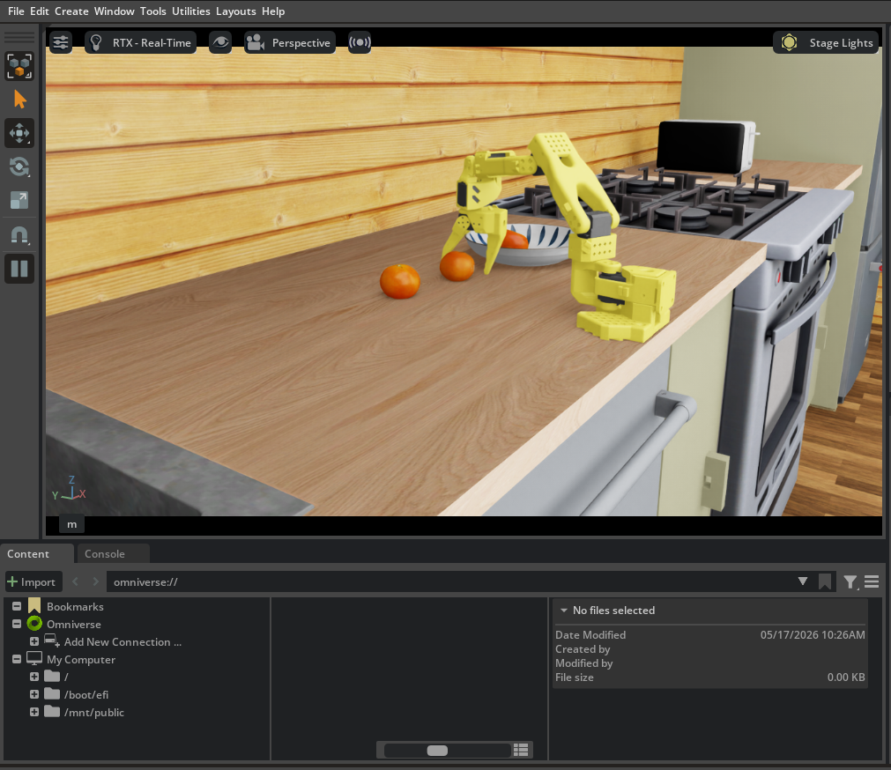

# LeIsaac — vitorcen fork

[LightwheelAI/leisaac](https://github.com/LightwheelAI/leisaac) (Apache-2.0) 的 fork。在 upstream 提供的 SO-101 遥操 + GR00T N1.5/N1.6 微调配方之上，扩展了**通用 LeRobot 微调脚手架**、**PickOrange 多策略横评**、以及一组让非平凡 VLA 能在 Isaac Sim 上跑通的 client 端补丁。
_A fork of [LightwheelAI/leisaac](https://github.com/LightwheelAI/leisaac) (Apache-2.0). Extends the upstream SO-101 teleop + GR00T fine-tune recipes with a generic LeRobot fine-tune scaffold, a PickOrange multi-policy benchmark, and client-side fixes that make non-trivial VLAs evaluable in Isaac Sim._



- **Upstream / 原仓库**: https://github.com/LightwheelAI/leisaac
- **Upstream docs**: https://lightwheelai.github.io/leisaac/
- **本 fork**: https://github.com/vitorcen/LeIsaac

原 LeIsaac repo 已包含 SO-101 Isaac Sim 遥操作和 `LeIsaac-SO101-PickOrange-v0` 任务的 GR00T N1.5 / N1.6 微调配方。本 README 只描述**本 fork 在 upstream 之上新增的内容**。Upstream 原生功能请看 [upstream docs](https://lightwheelai.github.io/leisaac/)。
_The original LeIsaac repo already covers SO-101 teleop + GR00T fine-tuning. This README only covers **what this fork adds on top of upstream**._

---

## 本 fork 新增内容
_What this fork adds_

### 1. 通用 LeRobot 微调脚手架
_Reusable LeRobot fine-tune scaffold_

端到端、环境变量驱动的脚本：拉 dataset → v2.1→v3.0 转换 → `lerobot-train`。同一套 scaffold 适配 SmolVLA / ACT / Diffusion Policy / DiT / 以及（多一步准备）未来其他 LeRobot policy。
_End-to-end, env-driven scripts for dataset pull → v2.1→v3.0 conversion → `lerobot-train`. The same scaffold works for SmolVLA / ACT / Diffusion Policy / DiT and (with one prep step) other LeRobot policies._

| Script | Purpose |
| --- | --- |
| [`datasets/download.sh`](datasets/download.sh) | `bash datasets/download.sh <ORG>/<DATASET>` — 拉任何 LeRobot dataset 到 `datasets/raw/<basename>/` |
| [`datasets/convert_to_v30.sh`](datasets/convert_to_v30.sh) | v2.1 → v3.0 原地转换（lerobot ≥ 0.5.x 必须），幂等 |
| [`scripts/finetune/lerobot_finetune.sh`](scripts/finetune/lerobot_finetune.sh) | 通用 `lerobot-train` wrapper，所有 knob 走 env vars（`BASE_MODEL` / `DATASET_REPO_ID` / `STEPS` / `BATCH_SIZE` / `RENAME_MAP` / `EXTRA_ARGS` / ...） |
| [`scripts/finetune/smolvla/prepare_base.sh`](scripts/finetune/smolvla/prepare_base.sh) | SmolVLA 专用：clone `lerobot/smolvla_base` 后剥光 `input_features` + `empty_cameras` — 因为 draccus CLI override 是 dict-merge 不是 replace，原 base 自带的 `camera1/2/3 @ 256×256` 占位会污染微调路径 |

目录按语义分类（[[feedback-style]] 约定）：
_Directory layout follows semantic split:_
- `scripts/finetune/` = 从 pretrained base 微调 / fine-tune from a pretrained base
- `scripts/training/` = 从头训练 / train-from-scratch (ACT, Diffusion Policy, DiT)

详细文档：
- [`datasets/README.md`](datasets/README.md)
- [`scripts/finetune/README.md`](scripts/finetune/README.md)
- [`scripts/training/README.md`](scripts/training/README.md)

### 2. PickOrange 多策略横评
_PickOrange multi-policy benchmark_

把 `LeIsaac-SO101-PickOrange-v0` 当 benchmark，统一 eval harness 跑多个 policy family。最新结果：
_Treating `LeIsaac-SO101-PickOrange-v0` as a benchmark and evaluating multiple policy families through the same harness:_

| Policy | Params | `config.type` | 结果 / Result | 备注 / Notes |
| --- | --- | --- | --- | --- |
| [`LightwheelAI/leisaac-pick-orange-v0`](https://huggingface.co/LightwheelAI/leisaac-pick-orange-v0) | ~3B | `gr00t_n1_5` | ✅ 3/3 within 30s | upstream 官方 ckpt — SOTA |
| [`shadowHokage/act_policy`](https://huggingface.co/shadowHokage/act_policy) | ~80M | `act` | ✅ 1/1 within 60s | from-scratch, 10k step, batch 8 — 我们的复刻参考 |
| **[`wsagi/ACT-PickOrange`](https://huggingface.co/wsagi/ACT-PickOrange) （自训 / ours）** | ~80M | `act` | ✅ **1/1 @ horizon=32** | 复刻 shadowHokage 配方，10k step；horizon=16 卡死 2nd 颗 |
| **[`wsagi/DiffusionPolicy-PickOrange`](https://huggingface.co/wsagi/DiffusionPolicy-PickOrange) （自训 / ours）** | ~267M | `diffusion` | ⚠️ 1-2/3 | UNet 1D + ResNet18，DDIM 32-step inference hot-swap |
| [`edge-inference/smolvla-so101-pick-orange`](https://huggingface.co/edge-inference/smolvla-so101-pick-orange) | ~450M | `smolvla` | ❌ 0/3 @ 60s | 第三方 SmolVLA v1 fine-tune |
| 本地 `smolvla2-leisaac-pick-orange` *(命名误称，实际 `config.type=smolvla` v1)* | ~450M | `smolvla` | 🟡 2/5 @ horizon=50, 5×120s | 30k step, batch 8, schema-free base |

**核心结论 / Headlines**：

- 在 60-episode × 36k frames 的小数据规模下，**专精 visuomotor 的小模型（ACT 80M）追平 SOTA 大 VLA（GR00T 3B）**，远超 SmolVLA 这种大参数 VLM。
  _At 60-episode × 36k-frame data scale, small visuomotor-specialised models (ACT 80M) match SOTA large VLAs (GR00T 3B) and significantly outperform large VLM-based policies (SmolVLA)._
- **三个独立架构（ACT 回归 / DP 扩散 / SmolVLA VLM）共同 OOD on 3rd orange**：dataset 60 ep × 每集 1 次"放最后一颗"演示 → 全 family 在第 3 颗变难。**不是模型问题，是数据问题。**
  _Three independent architectures (ACT regression / DP diffusion / SmolVLA VLM) share an OOD bottleneck on the 3rd orange — caused by the dataset providing only one "place last orange" demo per episode. **Data problem, not model problem.**_

更详细的 round-by-round eval 数据 + DiT / SmolVLA2 / Octo / RDT 后续 priority 见 [`docs/finetune/policy_comparison_priorities.html`](docs/finetune/policy_comparison_priorities.html)。

### 3. 设计文档与 postmortem
_Design docs and postmortems_

- [`docs/training/act_eval_debug_postmortem.html`](docs/training/act_eval_debug_postmortem.html) — ACT eval 三个 sim-side 根因（`sim_warmup` / `step_hz=30` / `policy_action_horizon`）的完整诊断
  _Three sim-side root causes diagnosed for ACT eval._
- [`docs/training/dp_inference_speedup_and_dynamic_timeout.html`](docs/training/dp_inference_speedup_and_dynamic_timeout.html) — Diffusion Policy DDPM→DDIM hot-swap（393→147 ms/chunk）+ user-patience-cap eval timeout 完整 postmortem，含 SVG 拟合曲线
  _DP inference speedup via DDPM→DDIM hot-swap + dynamic timeout postmortem, with inline SVG fit curves._
- [`docs/finetune/smolvla2_finetune_pick_orange.html`](docs/finetune/smolvla2_finetune_pick_orange.html) — SmolVLA 微调 v1 失败 / v2 部分成功 + schema-free base recipe
- [`docs/finetune/policy_comparison_priorities.html`](docs/finetune/policy_comparison_priorities.html) — 横评 + DiT / SmolVLA2 / Octo / RDT-1B 后续优先级

### 4. LeIsaac client 端补丁
_LeIsaac client-side fixes for non-trivial VLAs_

主要改动在 `source/leisaac/leisaac/policy/service_policy_clients.py` 和 `scripts/evaluation/policy_inference.py`。Upstream LeIsaac 只针对 GR00T 验证；SmolVLA / DP / 我们的 ACT 暴露出几个 edge case：
_Main changes in `service_policy_clients.py` and `policy_inference.py`. Upstream only validates against GR00T; SmolVLA / DP / our ACT exposed several edge cases:_

- **Auto camera schema mapping** — `_build_camera_feature_map(ckpt_path, sim_cameras)` 读 ckpt 的 `config.json` 自动判别命名风格：natural keys (front/wrist) → 不 rename；占位 keys (camera1/2/3) → 位置式 rename + 给未用 slot 补零 → 避免 `KeyError: 'camera1'`
- **`must_go=True` on every observation** — 绕过 server 的 "Observation too similar to last obs predicted" dedup filter；不绕过的话 sim 静止帧会被 server 主动丢弃，client 永远拿不到 action
- **Bounded retry without deadlock** — `_receive_action()` 重试 8× (200ms cap) 应对首次慢推理；去掉了原版 `skip_send_observation` flag（一次重试耗尽后死锁 client）
- **`run_eval.sh` wrapper** — user-patience cap timeout (`startup + n_rounds × per_round`), inference probe + slowdown warning, ckpt config 自动解析 `n_action_steps` 得 effective_chunk

---

## ⚠️ 关键 inference 配置 — `policy_action_horizon=32`
_Critical inference setting — `policy_action_horizon=32`_

**对 chunk_size=100 的 ACT，LeIsaac.ipynb 默认 `policy_action_horizon=16` 是隐性陷阱。** 第二颗橙子永远过不去（爪子抖 / muting）。
_**For ACT with chunk_size=100, LeIsaac.ipynb's default `policy_action_horizon=16` is a hidden trap.** The policy deadlocks on the 2nd orange (gripper jitter / muting effect)._

### 根因 / Root cause

ACT 每 chunk 输出 100 步动作（一段**完整规划**）：前 ~10 步是"启动 / 加速"，中段 (step 20-80) 才是真正的**宏观运动**（接近 → 夹起 → 提起 → 运送 → 释放）。LeRobot async client 用直接窗口 receding horizon，每 `policy_action_horizon` 步重新 query 一次。
_Each ACT chunk outputs a 100-step planned trajectory: first ~10 steps = startup, steps 20-80 = macro-motion. LeRobot async client uses sliding-window receding horizon, re-querying every `policy_action_horizon` steps._

| horizon | 1st orange | 2nd orange | 3rd orange | 1/1 |
| --- | --- | --- | --- | --- |
| 8 | 🔴 卡死（夹着不动） | — | — | 0/1 |
| 16 (LeIsaac.ipynb 默认 / default) | ✅ | 🟡 muting / 爪子抖 | — | 0/1 |
| **32 (推荐 / recommended)** | ✅ | ✅ 折腾后成功 | ✅ 折腾后成功 | **1/1 ✅** |

### 推荐设定 / Recommended

```bash
--policy_action_horizon=32        # 不要用默认 16 / NOT the default 16
--step_hz=30                      # 对齐 dataset 30Hz / matches dataset
--episode_length_s=120
```

完整诊断和 chunk-execution 假设的 falsification 推理见 [`docs/training/act_eval_debug_postmortem.html`](docs/training/act_eval_debug_postmortem.html)。
_Full diagnosis and falsification reasoning in the postmortem doc._

---

## Quick start

```bash
# 1) 拉 dataset / Pull dataset (LeIsaac SO-101 PickOrange, ~670 MB)
bash datasets/download.sh
bash datasets/convert_to_v30.sh

# 2a) 从头训练 ACT / Train ACT from scratch (~5h on RTX 4090)
bash scripts/training/act/train.sh

# 2b) 或：从头训练 Diffusion Policy / Or: train DP from scratch
bash scripts/training/diffusion_policy/train.sh

# 2c) 或：微调 SmolVLA / Or: fine-tune SmolVLA from base
bash scripts/finetune/smolvla/prepare_base.sh
BASE_MODEL=$(pwd)/outputs/.bases/smolvla_base_no_features \
DATASET_REPO_ID=LightwheelAI/leisaac-pick-orange \
OUTPUT_NAME=smolvla-leisaac-pick-orange \
STEPS=30000 BATCH_SIZE=8 NUM_WORKERS=2 SAVE_FREQ=5000 \
EXTRA_ARGS='--dataset.video_backend=pyav' \
bash scripts/finetune/lerobot_finetune.sh

# 3) 启 LeRobot async server / Start LeRobot async server
bash ~/work/isaaclab-experience/scripts/policy_server.sh start lerobot

# 4) Isaac Sim eval — 注意 horizon=32 / Note horizon=32!
cd ~/work/isaaclab-experience/LeIsaac && \
  bash scripts/evaluation/run_eval.sh -- \
    --task=LeIsaac-SO101-PickOrange-v0 \
    --eval_rounds=3 --episode_length_s=120 --step_hz=30 \
    --policy_type=lerobot-act \
    --policy_host=127.0.0.1 --policy_port=8080 \
    --policy_timeout_ms=10000 \
    --policy_language_instruction='Pick up the orange and place it on the plate' \
    --policy_checkpoint_path=$(pwd)/outputs/act-leisaac-pick-orange/checkpoints/010000/pretrained_model \
    --policy_action_horizon=32 --device=cuda --enable_cameras
```

upstream 原生功能（teleoperation / datagen state machine / GR00T 微调等）请直接看 [upstream docs](https://lightwheelai.github.io/leisaac/)。
_For upstream-native features, see upstream docs._

---

## 致谢 / Acknowledgements

本 fork 基于 [LightwheelAI/leisaac](https://github.com/LightwheelAI/leisaac)，其自身致谢 [IsaacLab](https://github.com/isaac-sim/IsaacLab) 与 [LeRobot](https://github.com/huggingface/lerobot)。所有 upstream 贡献者保留其归属；本 fork 的改动是**增量式**的（新增 scripts / docs + 一组小补丁到 LeRobot service client）。
_This fork builds on [LightwheelAI/leisaac](https://github.com/LightwheelAI/leisaac); all upstream attributions retained. Changes here are additive (new scripts/docs + small client-side patches)._

## 引用 / Citation

按 upstream 约定引用：
_Cite the upstream project per their convention:_

```bibtex
@software{Lightwheel_and_LeIsaac_Project_Developers_LeIsaac_2025,
  author = {{Lightwheel} and {LeIsaac Project Developers}},
  license = {Apache-2.0},
  title = {{LeIsaac}},
  url = {https://github.com/LightwheelAI/leisaac},
  version = {0.4.0},
  year = {2026}
}
```

ACT 论文：
_ACT paper:_

```bibtex
@inproceedings{zhao2023learning,
  title={Learning Fine-Grained Bimanual Manipulation with Low-Cost Hardware},
  author={Zhao, Tony Z. and Kumar, Vikash and Levine, Sergey and Finn, Chelsea},
  booktitle={Robotics: Science and Systems},
  year={2023}
}
```

## License

Apache-2.0，与 upstream 一致 / same as upstream. 见 [LICENSE](LICENSE).
